# The Agentic AI Revolution: From Static LLMs to Dynamic Intelligent Agents

*Exploring how AI agents transform traditional language models into powerful, tool-wielding problem solvers*

## Introduction: Beyond Text-to-Text Limitations

While Large Language Models (LLMs) have revolutionized how we interact with AI, they face a fundamental constraint: they're essentially **text-to-text models** trained on static datasets. They cannot access real-time information, execute commands, or interact with the outside world. This is where **Agentic AI** enters the picture, transforming LLMs from brilliant but isolated minds into dynamic agents capable of taking action in the real world.

## Understanding the LLM Foundation


**Key LLM Characteristics:**
- **Text → Token → Text workflow**
- **Trained on historical data** (not current information)
- **No ability to fetch live data** or execute commands
- **Brilliant reasoning** but **limited by training cutoff**

## The Agentic AI Paradigm: LLM + Tools = Agent

Think of Agentic AI as giving your LLM "hands and feet." While the LLM remains the "brain," agents add the capability to interact with the external world through tools.


### Real-World Agent Example

Instead of saying "I don't have access to current weather data," an agent can:

1. **Recognize** the need for weather information
2. **Select** the appropriate weather tool
3. **Execute** the API call
4. **Process** the response
5. **Provide** current, accurate information

```javascript
async function getWeather(cityName = '') {
    const url = `https://wttr.in/${cityName.toLowerCase()}?format=%C+%t`;
    const { data } = await axios.get(url, { responseType: 'text' });
    return `The current weather in ${cityName} is ${data}`;
}
```

## The Agent Workflow: Extended Chain of Thought

Traditional CoT (Chain of Thought) uses **START → THINK → OUTPUT**. Agentic AI extends this with tools:


**Extended CoT Steps:**
- **START**: Understand the user's request
- **THINK**: Analyze what information/actions are needed
- **TOOL**: Execute external functions when required
- **OBSERVE**: Process tool results and integrate them
- **OUTPUT**: Provide comprehensive response

## Agent Implementation Architecture

```mermaid
sequenceDiagram
    participant U as User
    participant A as Agent
    participant L as LLM
    participant T as Tools

    U->>A: "What's the weather in Delhi?"
    A->>L: Process request with system prompt
    L->>A: START: User wants Delhi weather
    A->>L: Continue to THINK step
    L->>A: THINK: Need weather tool for Delhi
    A->>L: Continue to TOOL step
    L->>A: TOOL: getWeatherDetailsByCity(Delhi)
    A->>T: Execute weather API call
    T->>A: "Haze +26°C"
    A->>L: OBSERVE: Weather data received
    L->>A: OUTPUT: Current weather is Haze, 26°C
    A->>U: "The current weather in Delhi is Haze with 26°C"
```



### Tool Registry Pattern

Modern agent frameworks use a tool registry to manage available capabilities:

```javascript
const TOOL_MAP = {
    getWeatherDetailsByCity: getWeatherDetailsByCity,
    getGithubUserInfoByUsername: getGithubUserInfoByUsername,
    executeCommand: executeCommand,
    // Add more tools as needed
};
```


## Practical Agent Execution Example

Let's trace through a real agent interaction:

**User Query**: "What's the weather in Delhi?"

**Agent Execution Log**:
```
🔥 The user wants to know the current weather of Delhi.

🧠 I should check if there is a tool available to get the weather details of a city.

🧠 There is a tool called getWeatherDetailsByCity that can provide current weather data for a given city.

🧠 I need to call the tool getWeatherDetailsByCity with the input 'Delhi' to get the weather details.

🛠️: getWeatherDetailsByCity(Delhi) = The current weather of Delhi is Haze +26°C

🧠 I have received the weather details for Delhi which is Haze with a temperature of 26°C.

🤖 The current weather in Delhi is Haze with a temperature of 26°C.

Done...
```

## Multi-Tool Agent Capabilities


## Building Your First Agent Framework

### Core Components

1. **System Prompt with Tool Awareness**
```javascript
const systemPrompt = `You are an AI agent with access to external tools.

Available tools: ${Object.keys(TOOL_MAP).join(', ')}

Use the extended CoT format:
- START: Understand the request
- THINK: Determine if tools are needed
- TOOL: Execute required functions
- OBSERVE: Process tool results
- OUTPUT: Provide final response`;
```

2. **Tool Execution Handler**
```javascript
async function executeTool(toolName, params) {
    if (TOOL_MAP[toolName]) {
        try {
            const result = await TOOL_MAP[toolName](params);
            return result;
        } catch (error) {
            return `Error executing ${toolName}: ${error.message}`;
        }
    }
    return `Tool ${toolName} not found`;
}
```

3. **Agent Loop with Tool Integration**
```javascript
while (currentStep !== 'OUTPUT') {
    const response = await llm.complete(messages);

    if (response.step === 'TOOL') {
        const toolResult = await executeTool(
            response.toolName,
            response.params
        );

        // Add tool result to context
        messages.push({
            role: 'tool',
            content: toolResult
        });

        currentStep = 'OBSERVE';
    }
}
```

## Agent vs Traditional LLM Comparison


## Future of Agentic AI


### Emerging Capabilities

- **Multi-step reasoning** with tool chains
- **Self-healing workflows** that adapt to failures
- **Learning from interactions** to improve performance
- **Collaborative agent networks** for complex tasks

## Best Practices for Agent Development

### 1. **Tool Design Principles**
- **Single responsibility**: Each tool should do one thing well
- **Clear interfaces**: Consistent input/output patterns
- **Error handling**: Graceful failure modes
- **Documentation**: Clear descriptions for LLM understanding

### 2. **Security Considerations**
- **Input validation**: Sanitize all tool parameters
- **Access controls**: Limit tool capabilities appropriately
- **Audit logging**: Track all agent actions
- **Sandbox execution**: Isolate tool execution environments

### 3. **Performance Optimization**
- **Tool caching**: Cache frequent API results
- **Parallel execution**: Run independent tools concurrently
- **Smart routing**: Choose optimal tools for tasks
- **Context management**: Maintain relevant conversation history

## Conclusion: The Agent Advantage

Agentic AI represents a fundamental shift from static language models to dynamic, capable systems that can:

- **Access real-time information** from the internet
- **Execute complex multi-step workflows**
- **Interact with external systems and APIs**
- **Adapt responses based on live data**

The future belongs to AI systems that can not only think and reason but also act and interact with the world around them. By mastering agentic AI patterns, you're building the foundation for the next generation of intelligent applications.

---

*The journey from static LLMs to dynamic agents is just beginning. Every tool you build expands the realm of what's possible with AI.*