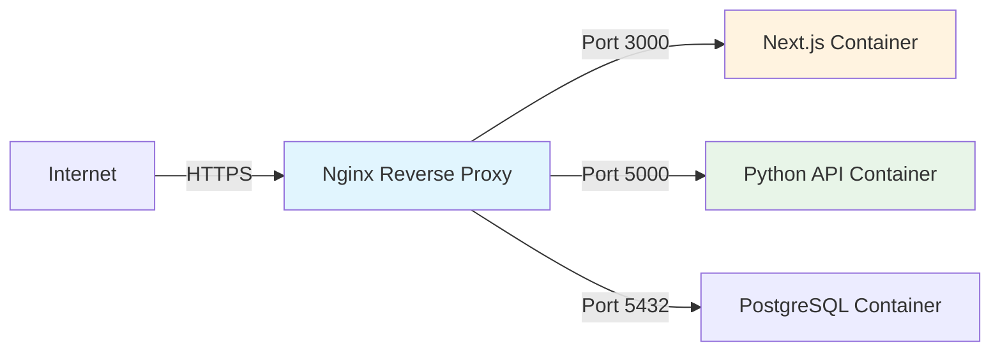

# The Ultimate Deployment Handbook: From Localhost to Production

*Stop relying on expensive cloud platforms and take control of your infrastructure.*

## Why This Handbook Exists

As developers, we often build amazing applications but stumble when it comes to deploying them reliably. Platforms like Vercel and Netlify are great, but they come with vendor lock-in and pricing cliffs. The **Deployment Handbook** is designed to bridge the gap between writing code and managing production servers.

This guide takes you from a fresh Ubuntu VPS to a production-ready server running multiple applications with **Nginx**, **Docker**, **SSL/TLS**, and automated **CI/CD**.

## What You'll Learn

This isn't just a list of commands. It's a structured path to mastering deployment:

### 1. The Foundation
-   **Initial Server Setup**: Security hardening, firewall configuration, and SSH key management.
-   **Nginx Architecture**: Understanding how to set up a robust reverse proxy.
-   **SSL Certificates**: Automated HTTPS with Let's Encrypt and Certbot.

### 2. Application Deployment
We cover modern deployment strategies using **Docker**:



-   **Containerization**: Writing efficient Dockerfiles for Node.js, Python, and Go.
-   **Orchestration**: Managing multi-container setups with Docker Compose.
-   **Zero-Downtime**: Strategies for updating apps without dropping connections.

### 3. Advanced CI/CD
Forget dragging and dropping files. We implement a GitOps workflow:
1.  Push code to GitHub.
2.  GitHub Actions triggers a build.
3.  Tests run automatically.
4.  If successful, the new version is deployed to your VPS.

## Core Concepts

### Reverse Proxy Pattern
Instead of exposing your application directly to the internet, we use Nginx as a gatekeeper. This provides security, caching, and SSL termination.

```nginx
server {
    listen 443 ssl http2;
    server_name api.yourdomain.com;

    location / {
        proxy_pass http://localhost:5000;
        proxy_set_header Host $host;
        proxy_set_header X-Real-IP $remote_addr;
    }
}
```

### Multi-Environment Setup
Learn how to run **Production** and **Staging** environments side-by-side on the same server, isolated by Docker networks and subdomains (e.g., `app.com` vs `staging.app.com`).

## Who Is This For?
-   **Developers** who want to understand the "black box" of deployment.
-   **Startups** looking to save costs on infrastructure.
-   **Students** wanting to add DevOps skills to their resume.

## Get Started

The entire handbook is open source and available on GitHub. It includes copy-paste ready configurations for Nginx, Docker, and GitHub Actions.

[**Explore the Deployment Handbook on GitHub**](https://github.com/manishdashsharma/deployment-handbook)

---

*Mastering deployment is the final step in becoming a complete software engineer. It gives you the freedom to build, ship, and scale on your own terms.*
