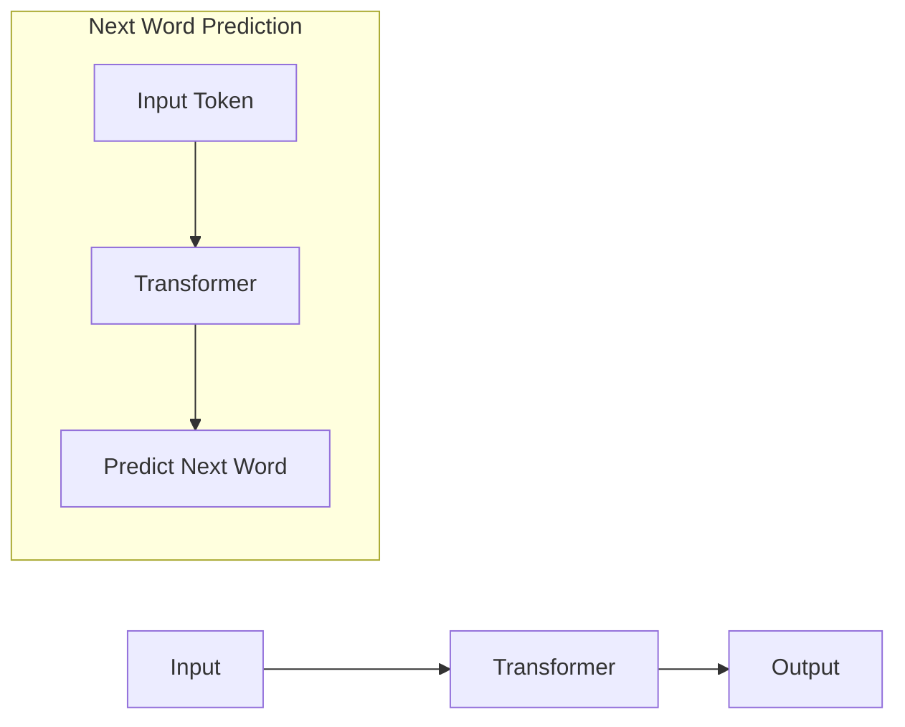
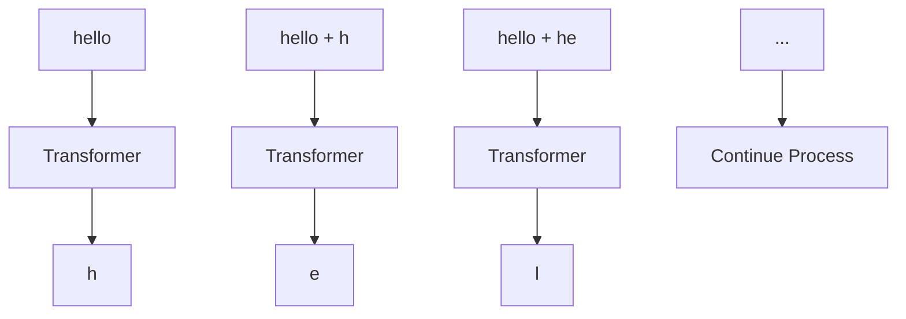
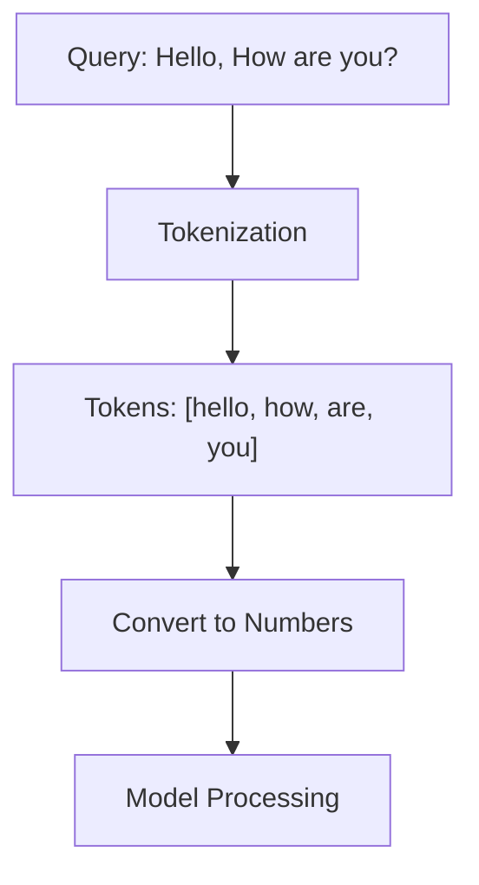
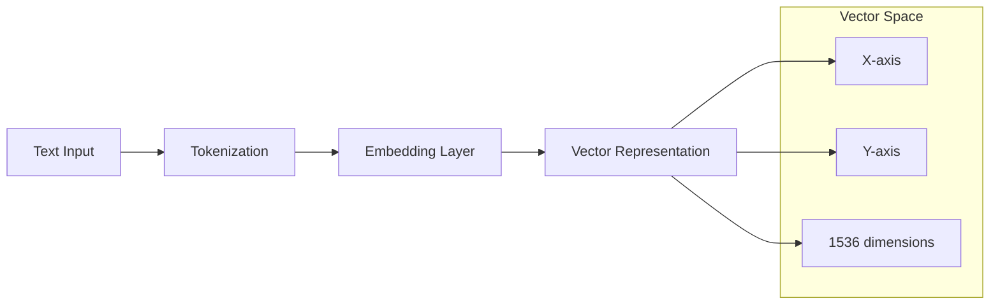
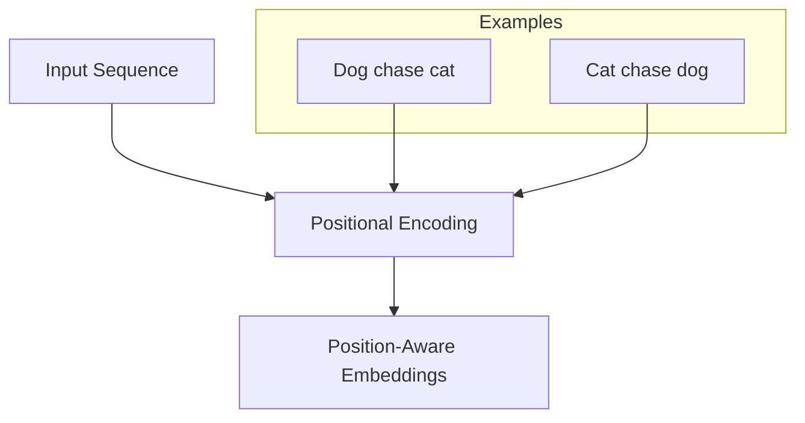
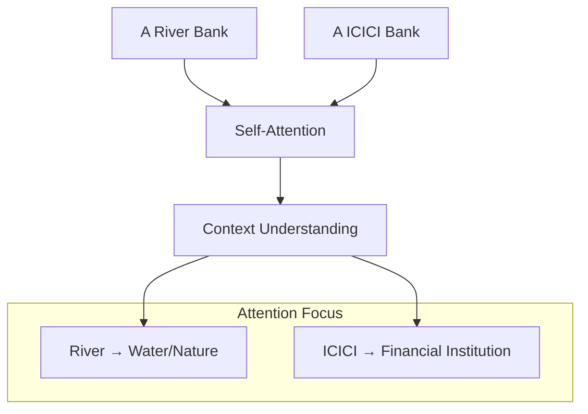
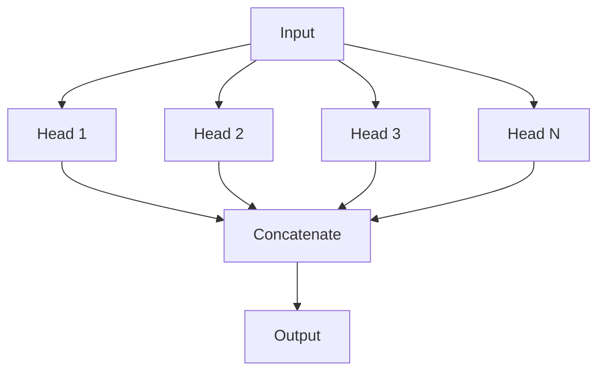
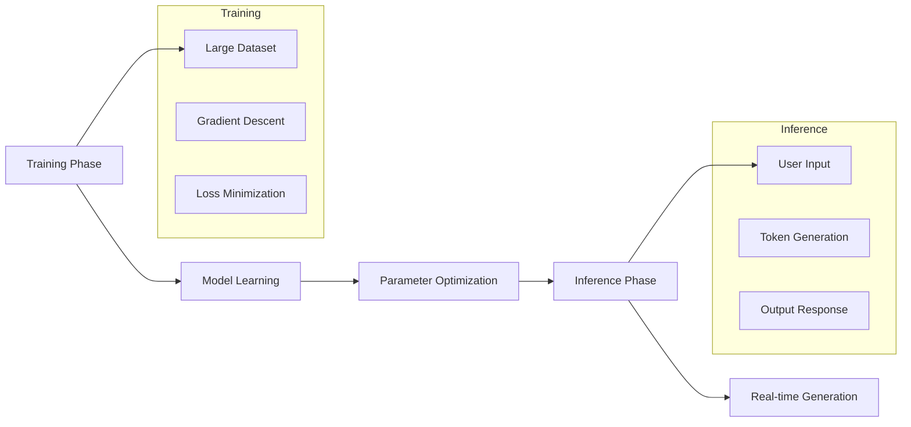

# Understanding GenAI Fundamentals: A Deep Dive into Transformers and Tokenization

## Introduction

Generative AI (GenAI) has revolutionized how we interact with technology. But what exactly is GenAI, and how does it work? In this comprehensive guide, we'll explore the fundamentals of GenAI, focusing on transformers, tokenization, and the intricate processes that make modern language models possible.

## What is GenAI?

Generative AI refers to artificial intelligence systems that can create new content, whether it's text, images, code, or other forms of media. Unlike traditional machine learning models that classify or predict based on existing data, GenAI models generate entirely new outputs based on patterns learned during training.

**Important Note**: GenAI is not just math or traditional machine learning - it represents a paradigm shift in how we approach AI problem-solving.

## The Transformer Architecture

At the heart of most modern GenAI systems lies the **Transformer** architecture. Let's visualize how it works:



### How Transformers Generate Text

The transformer works by predicting the next word in a sequence. Here's the step-by-step process:



## Tokenization: Breaking Down Text

Before text can be processed by a transformer, it must be converted into tokens. This process varies between different models:



### Model-Specific Tokenization

Different models handle tokenization differently:

#### GPT-4o Tokenization
```
Input: "Hey, How are you?"
Tokens: 13 tokens
Format: <|im_start|>system<|im_sep|>Hey, How are you?<|im_end|><|im_start|>assistant<|im_sep|>
Numeric: 200264, 17360, 200266, 25216, 11, 3253, 553, 481, 30, 200265, 200264, 173781, 200266
```

#### Google Gemma-7b Tokenization
```
Input: "Hey, How are you?"
Tokens: 7 tokens
Numeric: 2, 6750, 235269, 2299, 708, 692, 235336
```

## Implementing Tokenization in Code

You can work with tokenization using JavaScript:

```javascript
// Using js-tiktoken for tokenization
import { Tiktoken } from "js-tiktoken/lite";
import o200k_base from "js-tiktoken/ranks/o200k_base";

const enc = new Tiktoken(o200k_base);
// Encode and decode to verify
assert(enc.decode(enc.encode("hello world")) === "hello world");
```

## Input Embeddings: From Tokens to Vectors

Once tokenized, text is converted into numerical vectors through embeddings:



### Creating Embeddings with OpenAI

```javascript
import OpenAI from "openai";
const openai = new OpenAI();

const embedding = await openai.embeddings.create({
  model: "text-embedding-3-small",
  input: "Hey, How are you?",
  encoding_format: "float",
});

console.log(embedding);
// Vector size: 1536 for text-embedding-3-small
// Vector size: 3072 for text-embedding-3-large
```

## Key Transformer Components

### Positional Encoding

Word order matters in language. Consider these examples:
- "Dog chase cat" vs "Cat chase dog"



### Self-Attention Mechanism

Self-attention helps the model understand context and relationships between words:



### Multi-Head Attention

Multiple attention mechanisms work in parallel to capture different types of relationships:



## Transformer Phases

The transformer operates in two distinct phases:



## Conclusion

Understanding GenAI fundamentals requires grasping several key concepts:

1. **Transformers** serve as the backbone architecture
2. **Tokenization** converts text into processable units
3. **Embeddings** create meaningful vector representations
4. **Attention mechanisms** enable context understanding
5. **Training and inference** phases serve different purposes

These components work together to create the powerful generative AI systems we interact with today. As you continue your GenAI journey, these foundational concepts will prove essential for understanding more advanced topics and implementations.
