# Mastering AI Prompting: Advanced Techniques for Better Results

*An in-depth exploration of prompting strategies that transform AI interactions from basic to brilliant*

## Introduction: The Art of AI Communication

Building on our foundational understanding of GenAI, today we dive deep into the sophisticated world of **AI prompting**. Think of prompting as learning to speak the AI's language fluently—where precision in communication directly translates to quality in output.

## The GIGO Principle: Your Foundation for Success


**GIGO (Garbage In, Garbage Out)** is the fundamental principle governing all AI interactions:

- **Wrong input** → Wrong output
- **Quality input** → Quality output

The challenge? Who decides what constitutes "good output"? The answer lies in the training data—which we'll never fully access. This is why mastering prompting techniques becomes our primary tool for AI success.

## Understanding Prompt Formats: The Language of AI

Different AI models speak different "dialects." Let's explore the major prompt formats:


### ChatML: The Modern Standard

**ChatML (Chat Markup Language)** has become the de facto standard, especially popularized by OpenAI:

```javascript
async function main() {
    const response = await client.chat.completions.create({
        model: 'gpt-4o-mini',
        messages: [
            { role: 'user', content: 'Hey, How are you?' }
        ]
    });

    console.log(response.choices[0].message.content);
}
```

**Key Insight**: API calls are stateless—they don't remember previous conversations. You must provide context in each request, though cached tokens can reduce costs.

## The Prompting Techniques Hierarchy


### 1. System Prompting: Setting the Stage

System prompts are pre-instructions that define the AI's behavior and constraints:

```javascript
async function systemPrompt() {
    const response = await client.chat.completions.create({
        model: 'gpt-4o-mini',
        messages: [
            {
                role: 'system',
                content: 'You are a helpful assistant that only understands JavaScript. Don\'t answer anything apart from JS questions.'
            },
            { role: 'user', content: 'Write a function that adds two numbers' }
        ]
    });
}
```

**Result**: The AI will only provide JavaScript-related answers, refusing other programming languages.

### 2. Few-Shot Prompting: Learning by Example

Few-shot prompting provides examples to guide the AI's responses:


```javascript
async function fewShotPrompt() {
    const response = await client.chat.completions.create({
        model: "gpt-4o-mini",
        messages: [
            {
                role: "system",
                content: `You are a helpful assistant that only understands JS.

                Example:
                Q: Write a function that adds two numbers
                A: function add(a, b) { return a + b; }

                Q: Do you know about Python?
                A: I am sorry, I can only help with JavaScript related queries.`
            },
            { role: "user", content: "Write a function that adds two numbers" },
            { role: "assistant", content: "function add(a, b) {\n  return a + b;\n}" },
            { role: "user", content: "Write a function that multiplies two numbers in Python" }
        ]
    });
}
```

### 3. Chain of Thought (CoT): Structured Reasoning

CoT prompting encourages step-by-step thinking, dramatically improving accuracy for complex problems:


#### Manual Chain of Thought

```javascript
async function chainPrompt() {
    const response = await client.chat.completions.create({
        model: "gpt-4o-mini",
        messages: [{
            role: "system",
            content: `You work in START, THINK, OUTPUT format.

            Rules:
            - Always think step by step
            - Verify answer before final output
            - Use JSON format: {"step":"START|THINK|OUTPUT", "content":"string"}

            Example:
            {"step":"START", "content":"Analyzing expression 3 + 4 * 10 - 4 * 3"}
            {"step":"THINK", "content":"Following PEMDAS: 4*10=40, 4*3=12, so 3+40-12=31"}
            {"step":"OUTPUT", "content":"The final answer is 31"}`
        }]
    });
}
```

#### Automated Chain of Thought

The advanced implementation uses a while loop to automatically progress through all steps:

```mermaid
flowchart TD
    A[Start CoT Process] --> B[Initialize Steps Array]
    B --> C{Current Step < Total Steps?}

    C -->|Yes| D[Send Request for Current Step]
    D --> E[Parse JSON Response]
    E --> F{Valid JSON?}

    F -->|No| G[Retry with Error Handling]
    G --> D

    F -->|Yes| H[Extract Step & Content]
    H --> I{Expected Step?}

    I -->|Yes| J[Log Success with Emoji]
    I -->|No| K[Log Warning, Continue]

    J --> L[Add to Conversation]
    K --> L
    L --> M[Add Next Step Prompt]
    M --> N[Increment Step Counter]
    N --> C

    C -->|No| O[Process Complete 🎉]

    style A fill:#e3f2fd
    style O fill:#e8f5e8
    style G fill:#ffebee
```



```javascript
async function chainPromptAuto() {
    console.log("🚀 Starting Chain Prompt Auto Process...\n");

    const expectedSteps = ["START", "THINK", "OUTPUT"];
    let currentStepIndex = 0;

    while (currentStepIndex < expectedSteps.length) {
        const expectedStep = expectedSteps[currentStepIndex];

        try {
            console.log(`⏳ Processing step: ${expectedStep}...`);

            const response = await client.chat.completions.create({
                model: "gpt-4o-mini",
                messages: messages
            });

            // Robust JSON parsing with error handling
            const parsedResponse = JSON.parse(response.choices[0].message.content);
            const { step, content } = parsedResponse;

            if (step === expectedStep) {
                const stepEmoji = step === "START" ? "🚀" : step === "THINK" ? "🤔" : "✅";
                console.log(`${stepEmoji} ${step}: ${content}\n`);
                currentStepIndex++;
            }

        } catch (error) {
            console.log(`❌ Error: ${error.message}`);
            console.log(`🔄 Retrying...`);
        }
    }

    console.log("🎉 Chain Prompt Auto Process Completed!");
}
```

### 4. Persona-Based Prompting: Role Playing for Results

Persona-based prompting assigns specific roles or personalities to the AI, creating more targeted and consistent responses:


**Key Principle**: The more detailed and comprehensive your persona description, the better the AI's performance in that role.

## Best Practices for Prompt Engineering

### 1. **Precision in Language**
- Use specific, unambiguous terms
- Define context clearly
- Specify desired output format

### 2. **Structured Approaches**
- Break complex tasks into steps
- Use consistent formatting
- Implement error handling

### 3. **Iterative Refinement**
- Test and adjust prompts
- Analyze failure patterns
- Build prompt libraries

## The Future of Prompting


## Conclusion: Mastery Through Practice

Effective prompting is both art and science. By understanding these fundamental techniques—from basic system prompts to sophisticated chain-of-thought reasoning—you're building the skills necessary to unlock AI's full potential.

Remember: every interaction with AI is an opportunity to refine your prompting skills. Start with these techniques, experiment boldly, and watch your AI collaborations transform from simple exchanges to powerful problem-solving partnerships.

---

*Continue your GenAI journey with hands-on experimentation and consistent practice. The future belongs to those who can effectively communicate with artificial intelligence.*