# RAG: Building Intelligent Document-Aware AI Systems

*From problem to solution: How Retrieval-Augmented Generation transforms static LLMs into dynamic, knowledge-rich assistants*

## Introduction: The Knowledge Gap Problem

Imagine you're a lawyer with thousands of case files, precedents, and legal documents. A client asks about a specific case similar to one you handled years ago. You know the information exists somewhere in your files, but finding it manually would take hours. This is exactly the problem **RAG (Retrieval-Augmented Generation)** solves for AI systems.

## The Real-World Challenge: Beyond LLM Limitations


**The Core Problems:**
1. **Private documents can't be on the internet** - Confidential business data, legal files, internal reports
2. **LLMs don't have access to your specific documents** - They only know their training data
3. **Manual file search is impractical** - Humans can't efficiently search through thousands of documents
4. **System prompt limitations** - Even if we put everything in the prompt, we hit token limits and cost issues

## The Naive Approach: Why Simple Solutions Fail

Let's trace through the problems with obvious solutions:


**Why These Approaches Fail:**
- **Manual search**: Human limitation in processing thousands of documents
- **Dump everything in prompt**: Token limits and massive costs
- **LLM checking each document**: 3000 API calls = prohibitively expensive

## RAG: The Elegant Solution

RAG solves this through a two-phase approach: **Retrieval** + **Generation**


### The RAG Process Explained

**Indexing Phase (Done Once):**
1. **Document Loading**: Read PDFs, Word docs, text files
2. **Chunking**: Split large documents into smaller, manageable pieces
3. **Embedding**: Convert text chunks into vector representations
4. **Storage**: Store vectors + metadata in vector database

**Query Phase (Real-time):**
1. **Query Embedding**: Convert user question to vector
2. **Similarity Search**: Find most relevant document chunks
3. **Context Assembly**: Provide relevant chunks to LLM
4. **Generation**: LLM generates answer based on retrieved context

## Hands-On Implementation: Building a RAG System

Let's build a complete RAG system using LangChain and real code:

### Step 1: Document Loading and Processing

```javascript
import { PDFLoader } from "@langchain/community/document_loaders/fs/pdf";

// Load documents
const pdfFilePath = "./Resume.pdf";
const loader = new PDFLoader(pdfFilePath);
const docs = await loader.load();
console.log(`✅ Loaded ${docs.length} document(s) from PDF`);
```

### Step 2: Text Chunking (Optional but Recommended)

```javascript
import { RecursiveCharacterTextSplitter } from "@langchain/textsplitters";

const splitter = new RecursiveCharacterTextSplitter({
  chunkSize: 1000,      // Characters per chunk
  chunkOverlap: 200,    // Overlap between chunks
});

const splitDocs = await splitter.splitDocuments(docs);
```

### Step 3: Embedding and Vector Storage


```javascript
import { OpenAIEmbeddings } from "@langchain/openai";
import { QdrantVectorStore } from "@langchain/qdrant";

// Create embeddings
const embeddings = new OpenAIEmbeddings({
  apiKey: process.env.OPENAI_API_KEY,
  batchSize: 512,
  model: "text-embedding-3-large",
});

// Store in vector database
const vectorStore = await QdrantVectorStore.fromDocuments(
  docs,
  embeddings,
  {
    url: process.env.QDRANT_URL,
    collectionName: 'rag_docs',
    apiKey: process.env.QDRANT_API_KEY
  }
);
```

### Step 4: Query and Retrieval System

```javascript
async function chatWithRAG(userQuery) {
  // Connect to existing vector store
  const vectorStore = await QdrantVectorStore.fromExistingCollection(
    embeddings,
    { /* connection config */ }
  );

  // Create retriever
  const vectorSearcher = vectorStore.asRetriever({ k: 3 });

  // Get relevant documents
  const relevantDocs = await vectorSearcher.invoke(userQuery);

  // Format context for LLM
  const context = relevantDocs
    .map((doc, index) => `Document ${index + 1}:\n${doc.pageContent}`)
    .join('\n\n---\n\n');

  // Generate response with context
  const systemPrompt = `You are a helpful assistant that provides accurate information based on the provided context documents.

IMPORTANT RULES:
- Only use information from the provided context
- If the context doesn't contain the answer, respond with "I don't know based on the provided documents."
- Do not make up or infer information not explicitly stated in the context
- Be concise and direct in your responses

Context Documents:
${context}`;

  const response = await openai.chat.completions.create({
    model: "gpt-4o-mini",
    messages: [
      { role: "system", content: systemPrompt },
      { role: "user", content: userQuery }
    ],
    temperature: 0.1
  });

  return response.choices[0].message.content;
}
```

## Real Results: RAG in Action

Here's actual output from our RAG system:


**Example 1: Knowledge-based Query**
```
🎯 Query: "Who is Manish?"
📖 Answer: Manish Dash Sharma is a Software Developer and Technical Manager with expertise in full-stack development. He has experience in managing complex projects, leading cross-functional teams, and delivering scalable solutions.
```

**Example 2: Out-of-scope Query**
```
🎯 Query: "What is 1+2?"
📖 Answer: I don't know based on the provided documents.
```

## RAG Architecture Deep Dive


### Key Components Breakdown

**1. Document Loaders**
- Support for PDF, Word, HTML, Markdown, CSV
- Extracts text while preserving structure
- Handles metadata (page numbers, sections)

**2. Text Splitters**
- **RecursiveCharacterTextSplitter**: Respects sentence/paragraph boundaries
- **Chunk size**: Balance between context and token limits
- **Overlap**: Ensures context continuity across chunks

**3. Embedding Models**
- **text-embedding-3-large**: High-quality OpenAI embeddings
- **Vector dimensions**: 3072 for large model
- **Batch processing**: Reduces API calls and costs

**4. Vector Databases**
- **Qdrant**: High-performance vector search
- **Similarity search**: Cosine similarity, Euclidean distance
- **Metadata filtering**: Additional search constraints

## RAG vs Traditional Approaches

```mermaid
graph TD
    subgraph "Traditional LLM"
        A1[User Query] --> B1[LLM Only]
        B1 --> C1[Training Data Only]
        C1 --> D1[Generic/Outdated Response]
    end

    subgraph "RAG System"
        A2[User Query] --> B2[Vector Search]
        B2 --> C2[Relevant Documents]
        C2 --> D2[LLM + Context]
        D2 --> E2[Accurate, Current Response]
    end

    subgraph "Benefits"
        F[✅ Access to private data]
        G[✅ Always current information]
        H[✅ Transparent sources]
        I[✅ Reduced hallucinations]
        J[✅ Cost-effective scaling]
    end

    style D1 fill:#ffebee
    style E2 fill:#e8f5e8
    style F fill:#e8f5e8
    style G fill:#e8f5e8
    style H fill:#e8f5e8
    style I fill:#e8f5e8
    style J fill:#e8f5e8
```



## Advanced RAG Patterns and Optimizations

### 1. **Hybrid Search**
Combine vector search with keyword search for better retrieval:

```javascript
// Combine semantic and keyword search
const hybridRetriever = vectorStore.asRetriever({
  searchType: "similarity_score_threshold",
  searchKwargs: { scoreThreshold: 0.7, k: 5 }
});
```

### 2. **Query Rewriting**
Improve queries before vector search:

```javascript
const rewrittenQuery = await llm.predict(
  `Rewrite this query to be more specific and searchable: "${userQuery}"`
);
```

### 3. **Metadata Filtering**
Search within specific document types or date ranges:

```javascript
const filteredRetriever = vectorStore.asRetriever({
  filter: {
    document_type: "legal_case",
    date: { $gte: "2023-01-01" }
  }
});
```

## Production Considerations

### Performance Optimization


### Security & Privacy
- **Data isolation**: Separate vector stores per tenant
- **Access controls**: Role-based document access
- **Encryption**: At-rest and in-transit data protection
- **Audit logging**: Track all queries and responses

### Scalability Patterns
- **Horizontal scaling**: Distribute vector databases
- **Load balancing**: Multiple embedding API keys
- **Incremental updates**: Add new documents without full reindex
- **Monitoring**: Track query performance and accuracy

## Real-World Applications

### Legal Tech
- **Case law research**: Find similar precedents instantly
- **Contract analysis**: Extract clauses and terms
- **Compliance checking**: Verify regulatory requirements

### Enterprise Knowledge
- **Internal documentation**: Company policies and procedures
- **Technical manuals**: Product specifications and guides
- **Customer support**: FAQ and troubleshooting databases

### Healthcare
- **Medical research**: Literature and clinical studies
- **Patient records**: (with proper privacy controls)
- **Drug interactions**: Pharmaceutical databases

## Future of RAG: Emerging Trends


### Next-Generation Features
- **Multimodal retrieval**: Search across text, images, and videos
- **Graph-based RAG**: Knowledge graphs for complex relationships
- **Agentic workflows**: RAG systems that can use tools and take actions
- **Continuous learning**: Systems that improve from user feedback

## Conclusion: The RAG Revolution

RAG represents a fundamental shift in how we think about AI knowledge systems. Instead of trying to cram all information into ever-larger models, RAG provides a surgical approach: retrieve exactly what's needed, when it's needed.

**Key Takeaways:**
- **Solves real problems**: Private data access, current information, reduced hallucinations
- **Cost-effective**: More efficient than massive context windows
- **Transparent**: You can see exactly what information the AI used
- **Flexible**: Easy to update knowledge without retraining models
- **Practical**: Production-ready with existing tools and APIs

The future belongs to AI systems that can dynamically access and reason over vast knowledge bases. RAG isn't just a technique—it's the foundation for the next generation of intelligent applications.

---

**Ready to build your own RAG system?** Start with a simple document collection, experiment with different chunk sizes and embedding models, and gradually add complexity as you understand your use case better.

*The journey from static AI to dynamic, knowledge-aware systems starts with your first RAG implementation.*