# YouTube Architecture Decoded: The Engineering Marvel Behind 1 Billion Hours of Daily Video

*Understanding the complete journey from upload button to your screen - explained with real engineering patterns*

## Introduction: The Scale That Breaks Everything

Ever wondered how YouTube handles **500+ hours of video uploaded every minute** while streaming to **2 billion+ users** simultaneously? Traditional architectures would collapse under this load. YouTube's solution? A distributed masterpiece that redefines what's possible at scale.

Today, we'll decode the complete architecture - from the moment you hit "upload" to when someone halfway across the world watches your video in perfect quality.

## The Core Challenge: What Makes YouTube Hard?

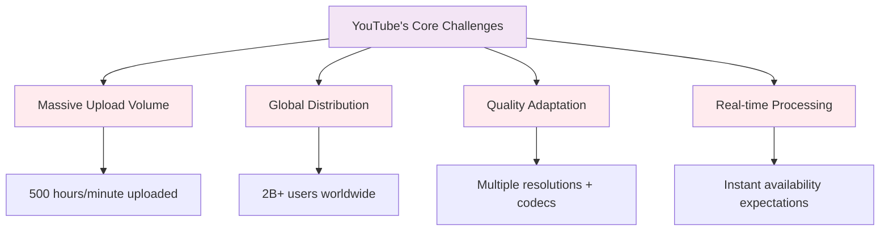

Unlike Netflix (pre-encoded content) or social media (small files), YouTube faces:
- **Unknown content at unpredictable times**
- **Need for instant processing** (users expect videos live in minutes)
- **Global reach** (serve from India to Iceland with same quality)
- **Adaptive streaming** (seamlessly handle 5G to 2G)

## Architecture Overview: The 30,000 Foot View

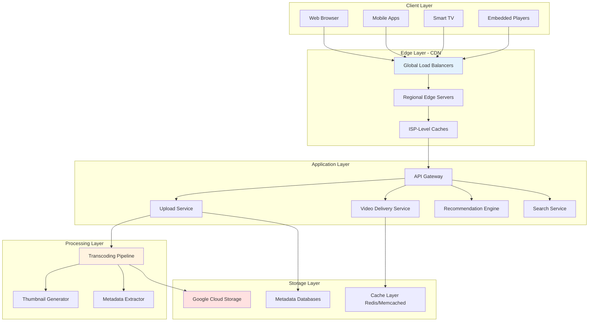

## Part 1: The Upload Journey - From Your Computer to YouTube's Servers

### Step 1: Upload Initialization

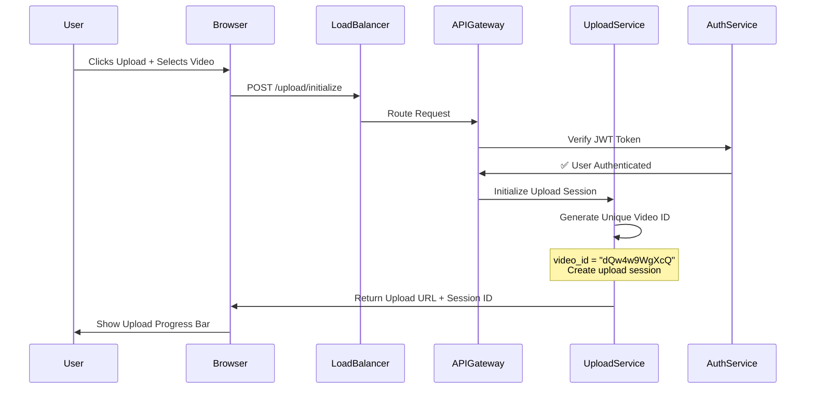

**Key Technical Decisions:**

1. **Video ID Generation**: YouTube uses base64-encoded unique IDs (11 characters)
   ```javascript
   // Simplified ID generation logic
   function generateVideoId() {
       const chars = 'ABCDEFGHIJKLMNOPQRSTUVWXYZabcdefghijklmnopqrstuvwxyz0123456789-_';
       let id = '';
       for(let i = 0; i < 11; i++) {
           id += chars[Math.floor(Math.random() * chars.length)];
       }
       return id; // Example: "dQw4w9WgXcQ"
   }
   ```

2. **Why Chunked Upload?**
   - Handle network failures gracefully
   - Resume interrupted uploads
   - Parallel chunk uploading for faster speeds

### Step 2: Chunked Upload Process

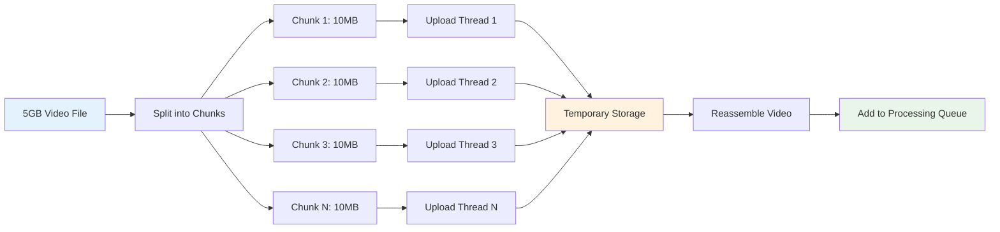

**Upload Service Architecture:**

```javascript
// Simplified upload handler
class UploadService {
    async handleChunk(videoId, chunkIndex, chunkData) {
        // Store chunk in temporary storage
        await tempStorage.put(
            `uploads/${videoId}/chunk_${chunkIndex}`,
            chunkData
        );
        
        // Track progress
        await redis.hincrby(`upload:${videoId}`, 'chunks_received', 1);
        
        const totalChunks = await redis.hget(`upload:${videoId}`, 'total_chunks');
        const receivedChunks = await redis.hget(`upload:${videoId}`, 'chunks_received');
        
        // All chunks received?
        if (receivedChunks === totalChunks) {
            await this.finalizeUpload(videoId);
        }
    }
    
    async finalizeUpload(videoId) {
        // Reassemble chunks
        const videoFile = await this.assembleChunks(videoId);
        
        // Add to processing queue
        await messageQueue.publish('video.uploaded', {
            videoId,
            filePath: videoFile.path,
            uploadedAt: Date.now()
        });
        
        // Cleanup temp storage
        await tempStorage.delete(`uploads/${videoId}/`);
    }
}
```

### Step 3: Message Queue & Job Distribution

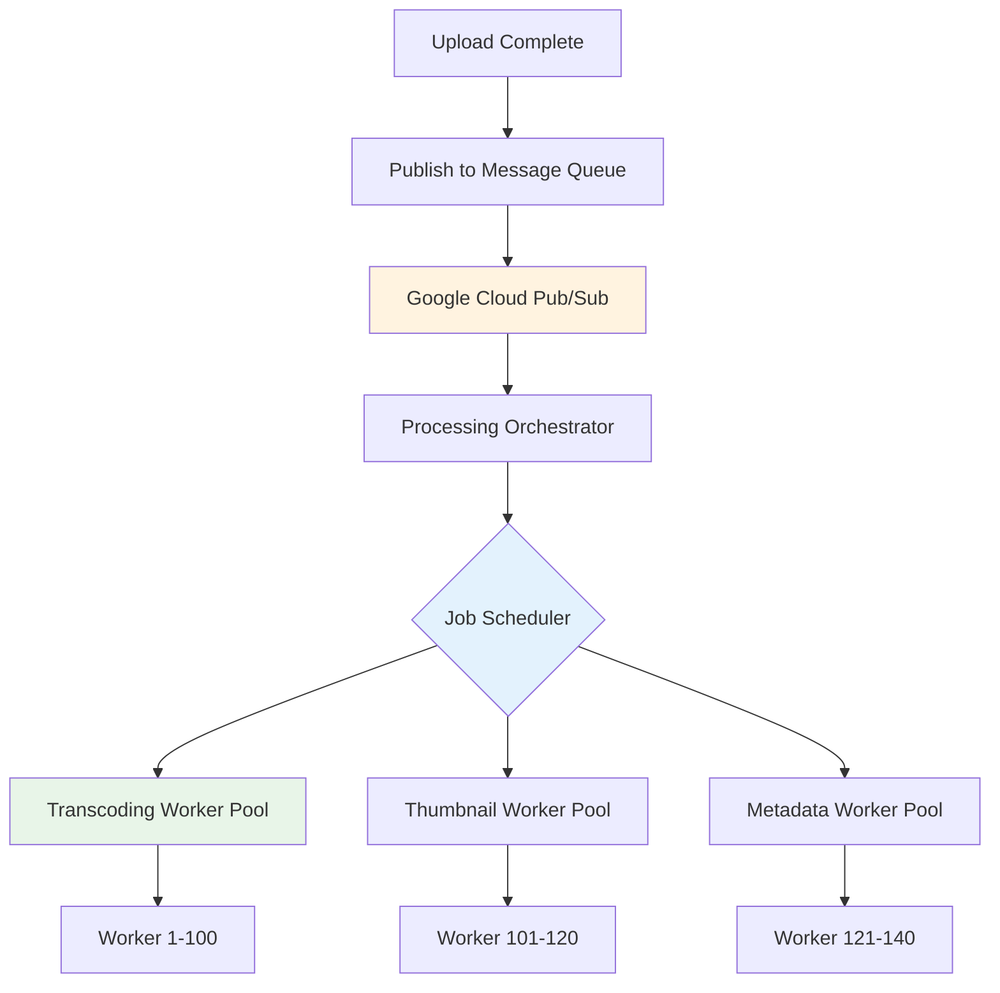

**Why Message Queues?**
- **Decoupling**: Upload service doesn't wait for processing
- **Scalability**: Add more workers as load increases
- **Reliability**: Jobs persist even if workers crash
- **Priority Handling**: Live streams get priority over old uploads

## Part 2: The Processing Pipeline - Creating 20+ Versions of Your Video

### The Transcoding Challenge

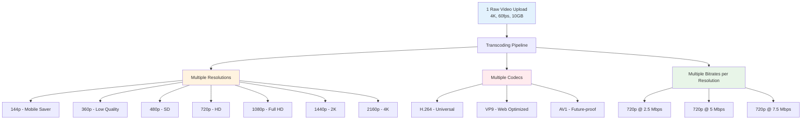

**Result**: 1 uploaded video becomes **20-40 different versions** to serve different devices and network conditions.

### Transcoding Worker Architecture

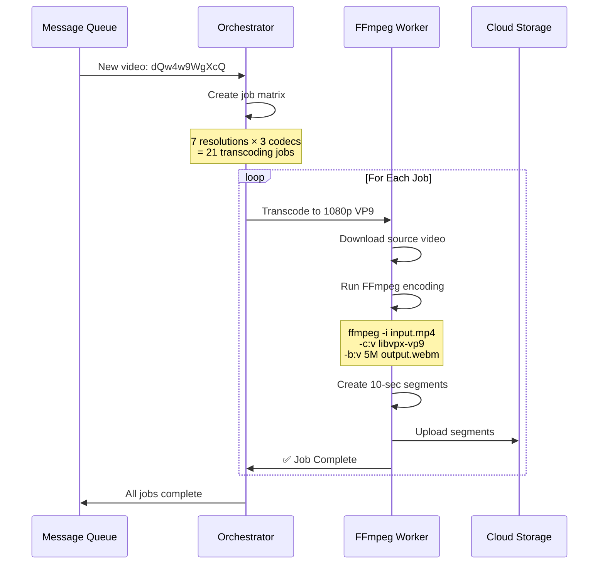

**Real FFmpeg Command:**

```bash
# Example: Transcode to 1080p VP9 with segmentation
ffmpeg -i input.mp4 \
  -c:v libvpx-vp9 \
  -b:v 5M \
  -c:a libopus \
  -b:a 128k \
  -vf scale=-2:1080 \
  -f dash \
  -seg_duration 10 \
  -use_timeline 1 \
  -use_template 1 \
  output_1080p_vp9.mpd
```

### Parallel Processing with Worker Pools

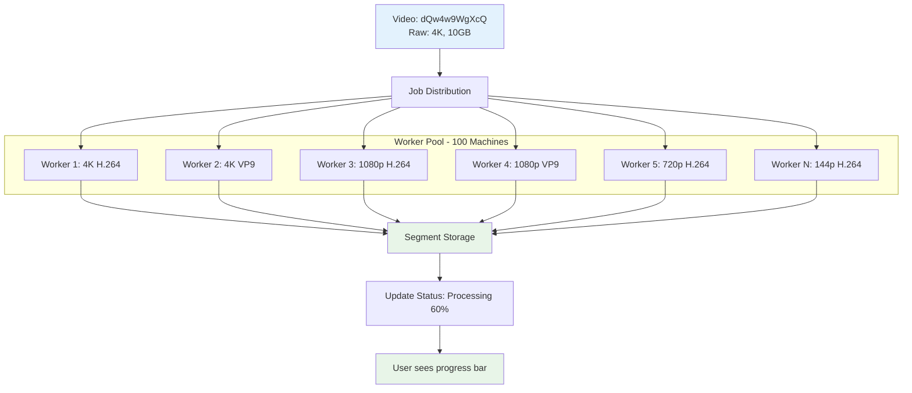

**Key Insight**: All resolution/codec combinations process **in parallel**, dramatically reducing total processing time from hours to minutes.

## Part 3: Storage Architecture - Where Does Everything Live?

### Hierarchical Storage System

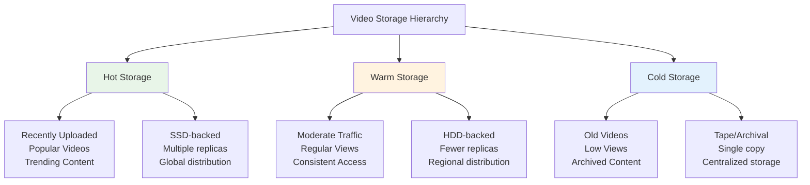

### File Organization Structure

```
Google Cloud Storage Bucket: youtube-videos-us-east
│
├── video_id: dQw4w9WgXcQ/
│   │
│   ├── formats/
│   │   ├── 1080p_h264/
│   │   │   ├── segment_0001.mp4
│   │   │   ├── segment_0002.mp4
│   │   │   ├── segment_0003.mp4
│   │   │   └── manifest.mpd
│   │   │
│   │   ├── 1080p_vp9/
│   │   │   ├── segment_0001.webm
│   │   │   └── manifest.mpd
│   │   │
│   │   ├── 720p_h264/
│   │   └── 360p_h264/
│   │
│   ├── thumbnails/
│   │   ├── default.jpg
│   │   ├── mq.jpg (medium quality)
│   │   ├── hq.jpg (high quality)
│   │   └── maxres.jpg (maximum resolution)
│   │
│   └── metadata.json
```

### Database Architecture: Metadata Management

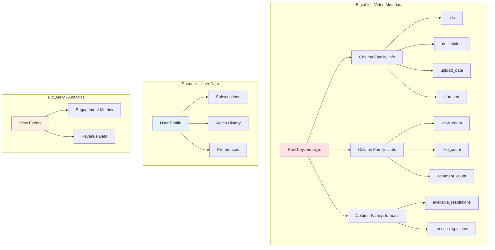

**Why Bigtable for Video Metadata?**
- **Massive scale**: Handles billions of videos
- **Low latency**: Millisecond reads
- **Flexible schema**: Easy to add new metadata fields
- **Strong consistency**: For critical data

**Sample Bigtable Entry:**

```json
{
    "row_key": "dQw4w9WgXcQ",
    "column_families": {
        "info": {
            "title": "Never Gonna Give You Up",
            "uploader_id": "RickAstleyVEVO",
            "upload_timestamp": 1634567890,
            "duration_seconds": 213,
            "category": "Music"
        },
        "stats": {
            "view_count": 1500000000,
            "like_count": 15000000,
            "comment_count": 2500000
        },
        "formats": {
            "available_qualities": ["144p", "360p", "720p", "1080p", "4K"],
            "available_codecs": ["h264", "vp9", "av1"],
            "processing_status": "complete"
        }
    }
}
```

## Part 4: CDN & Streaming - Getting Videos to Users Smoothly

### Global CDN Architecture

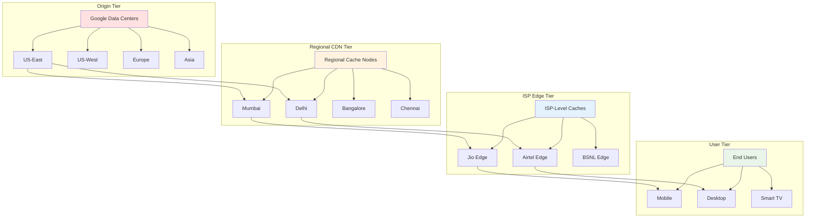

### How Smooth Streaming Actually Works

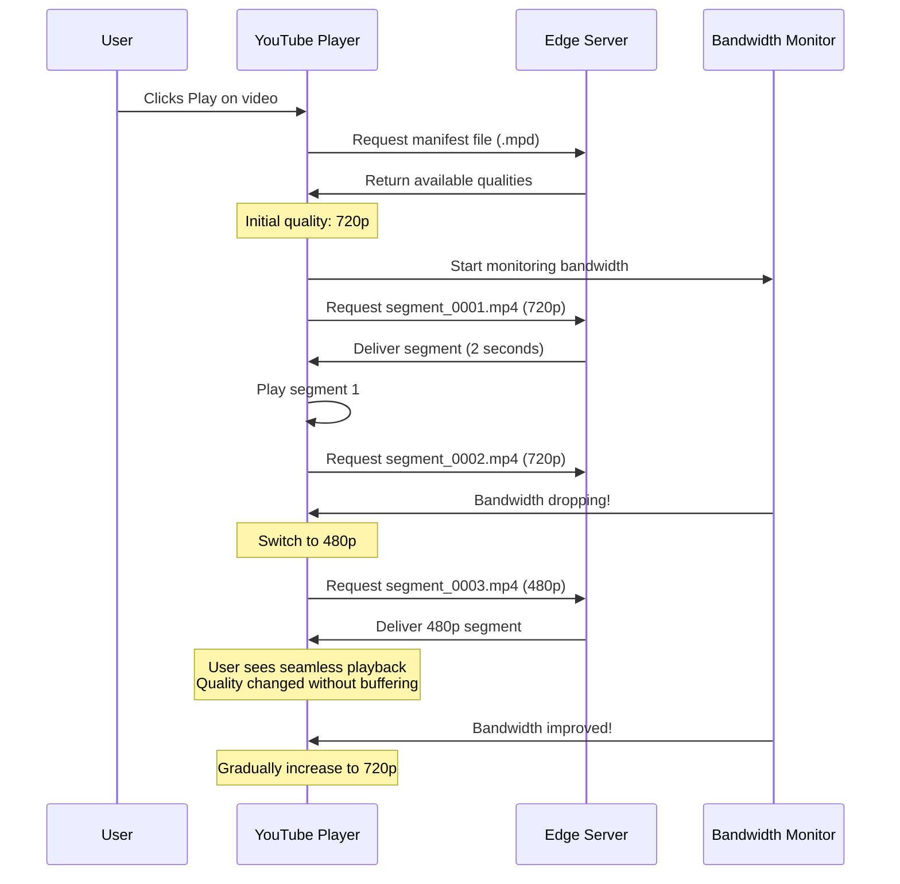

### Adaptive Bitrate Streaming (ABR) Logic

```javascript
class AdaptiveBitrateController {
    constructor() {
        this.currentQuality = '720p';
        this.buffer = [];
        this.bandwidthSamples = [];
    }
    
    async selectNextSegment(segmentIndex) {
        // Measure current bandwidth
        const bandwidth = await this.measureBandwidth();
        this.bandwidthSamples.push(bandwidth);
        
        // Calculate average bandwidth (last 5 samples)
        const avgBandwidth = this.getAverageBandwidth();
        
        // Check buffer health
        const bufferHealth = this.getBufferDuration();
        
        // Decision logic
        let targetQuality;
        
        if (bufferHealth < 5) {
            // Buffer is low, drop quality immediately
            targetQuality = this.getQualityForBandwidth(avgBandwidth * 0.7);
        } else if (avgBandwidth > this.getCurrentQualityBitrate() * 1.5) {
            // Bandwidth is good, can upgrade
            targetQuality = this.getQualityForBandwidth(avgBandwidth * 0.9);
        } else if (avgBandwidth < this.getCurrentQualityBitrate() * 0.8) {
            // Bandwidth dropping, downgrade
            targetQuality = this.getQualityForBandwidth(avgBandwidth * 0.9);
        } else {
            // Stay at current quality
            targetQuality = this.currentQuality;
        }
        
        this.currentQuality = targetQuality;
        return this.fetchSegment(segmentIndex, targetQuality);
    }
    
    getQualityForBandwidth(bandwidth) {
        const qualityMap = {
            '144p': 250000,    // 250 Kbps
            '360p': 1000000,   // 1 Mbps
            '480p': 2500000,   // 2.5 Mbps
            '720p': 5000000,   // 5 Mbps
            '1080p': 8000000,  // 8 Mbps
            '1440p': 16000000, // 16 Mbps
            '4K': 35000000     // 35 Mbps
        };
        
        // Find best quality that fits bandwidth
        for (const [quality, requiredBandwidth] of Object.entries(qualityMap).reverse()) {
            if (bandwidth >= requiredBandwidth) {
                return quality;
            }
        }
        
        return '144p'; // Fallback to lowest quality
    }
}
```

### DASH Manifest Example

```xml
<?xml version="1.0" encoding="UTF-8"?>
<MPD xmlns="urn:mpeg:dash:schema:mpd:2011">
    <Period>
        <!-- Video Representations -->
        <AdaptationSet mimeType="video/mp4">
            <Representation id="1080p" bandwidth="8000000" width="1920" height="1080">
                <BaseURL>https://cdn.youtube.com/video/dQw4w9WgXcQ/1080p/</BaseURL>
                <SegmentTemplate media="segment_$Number$.mp4" duration="10"/>
            </Representation>
            
            <Representation id="720p" bandwidth="5000000" width="1280" height="720">
                <BaseURL>https://cdn.youtube.com/video/dQw4w9WgXcQ/720p/</BaseURL>
                <SegmentTemplate media="segment_$Number$.mp4" duration="10"/>
            </Representation>
            
            <Representation id="480p" bandwidth="2500000" width="854" height="480">
                <BaseURL>https://cdn.youtube.com/video/dQw4w9WgXcQ/480p/</BaseURL>
                <SegmentTemplate media="segment_$Number$.mp4" duration="10"/>
            </Representation>
        </AdaptationSet>
        
        <!-- Audio Representations -->
        <AdaptationSet mimeType="audio/mp4">
            <Representation id="audio_high" bandwidth="128000">
                <BaseURL>https://cdn.youtube.com/video/dQw4w9WgXcQ/audio/</BaseURL>
                <SegmentTemplate media="segment_$Number$.m4a" duration="10"/>
            </Representation>
        </AdaptationSet>
    </Period>
</MPD>
```

## Part 5: Supporting Services - The Ecosystem

### Recommendation Engine Architecture

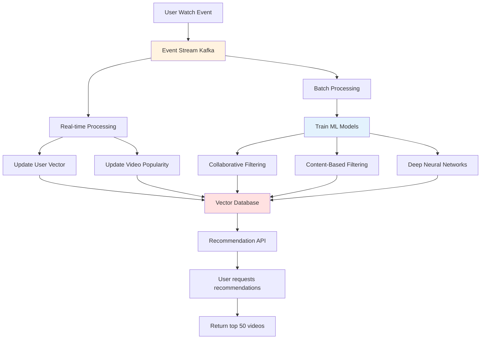

### Search Service Architecture

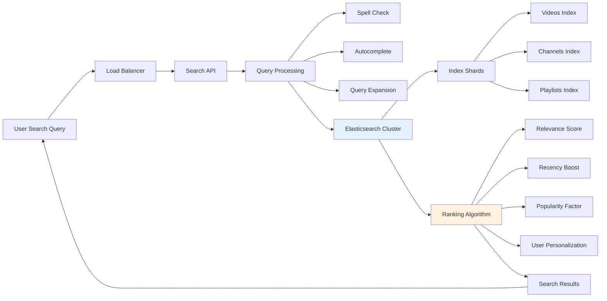

## The Complete Request Flow: When You Click Play

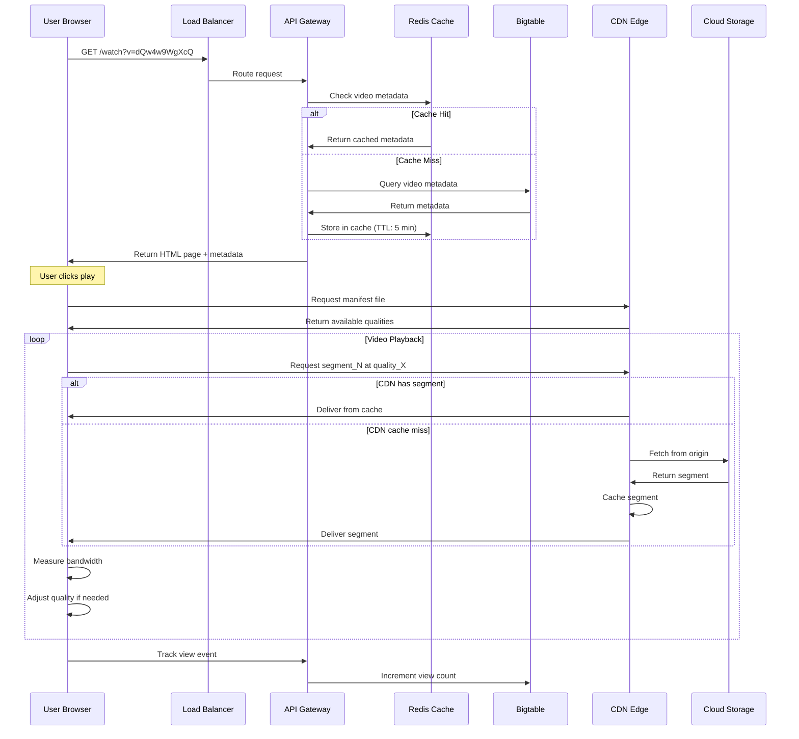

## Performance Optimizations: Making It All Fast

### 1. Pre-computation & Caching Strategy

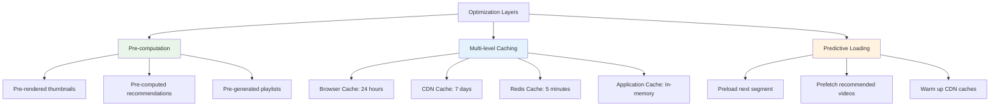

### 2. Database Sharding Strategy

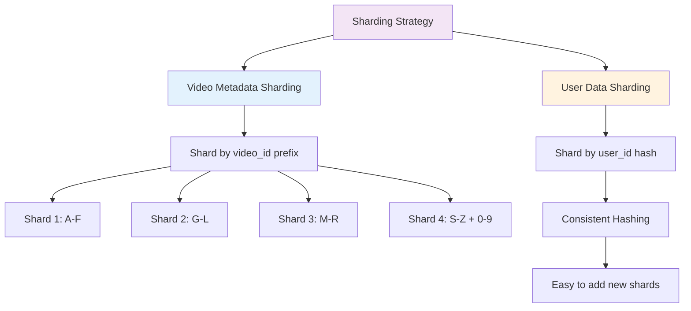

## Monitoring & Reliability

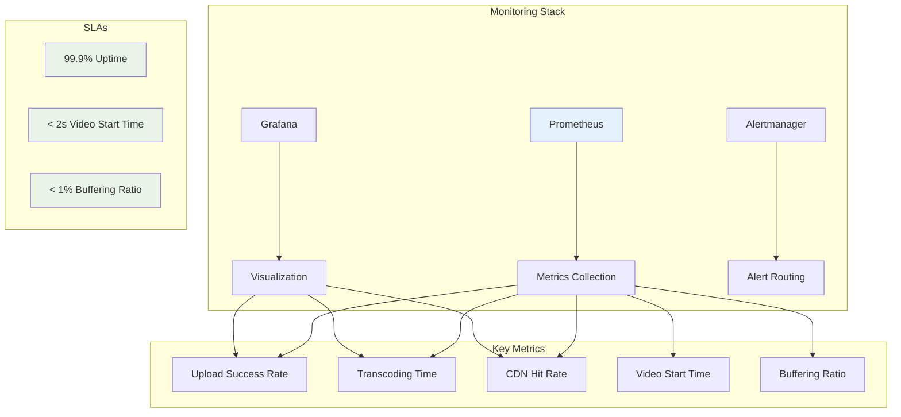

## Scaling Numbers: YouTube at a Glance

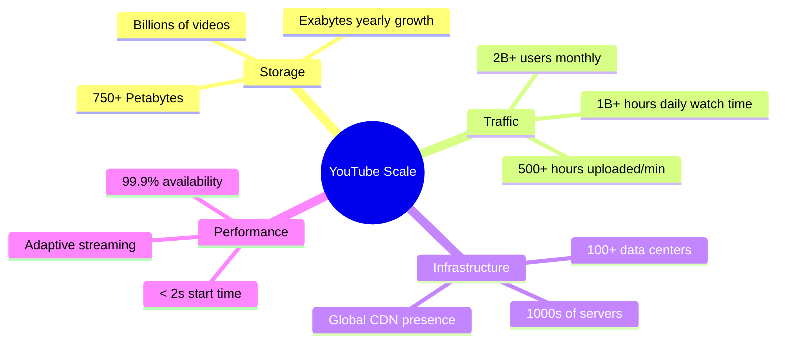

## Key Takeaways: What Makes This Architecture Work

### 1. **Horizontal Scalability**
- Every component can scale independently
- Add more machines, not bigger machines
- Microservices architecture

### 2. **Asynchronous Processing**
- Upload ≠ Processing ≠ Delivery
- Message queues decouple everything
- Users don't wait for transcoding

### 3. **Aggressive Caching**
- Cache at every layer
- CDN brings content close to users
- Popular videos heavily replicated

### 4. **Adaptive Everything**
- Adaptive bitrate streaming
- Adaptive cache policies
- Adaptive resource allocation

### 5. **Global Distribution**
- Content replicated worldwide
- Smart routing to nearest server
- Regional failover capabilities

## Conclusion: Engineering at Planetary Scale

YouTube's architecture isn't just impressive—it's a masterclass in distributed systems design. From the moment you upload a video to when someone watches it on the other side of the world, hundreds of systems work in perfect harmony.

The key principles:
- ✅ **Scale horizontally**, not vertically
- ✅ **Decouple everything** with message queues
- ✅ **Cache aggressively** at every layer
- ✅ **Distribute globally**, serve locally
- ✅ **Adapt dynamically** to changing conditions

This is the architecture that handles **1 billion hours of video every single day**. And it does it so well, you never even think about the engineering marvel happening behind that play button.

---

*Understanding systems like YouTube isn't just about learning architecture—it's about understanding how to build for scale, reliability, and global reach. These are the principles that power the modern internet.*
